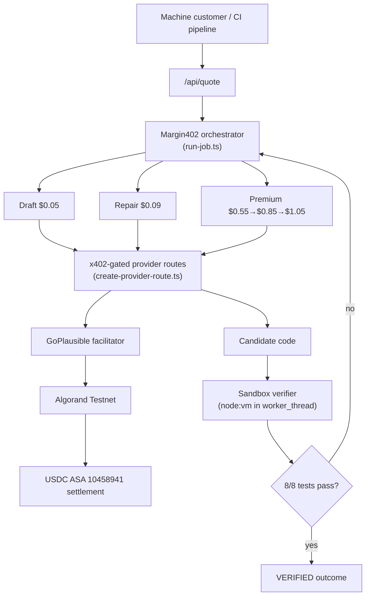
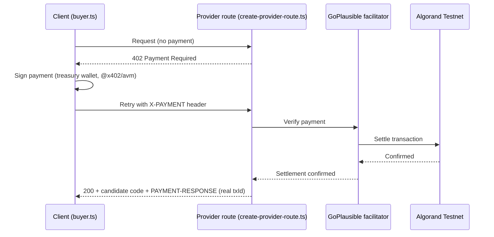
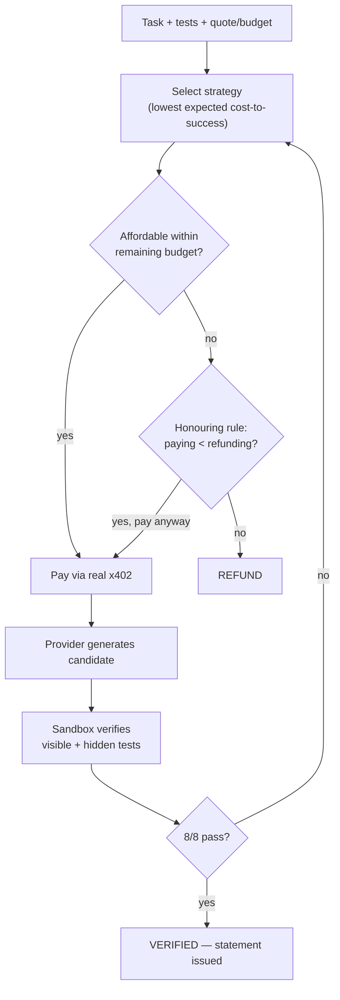
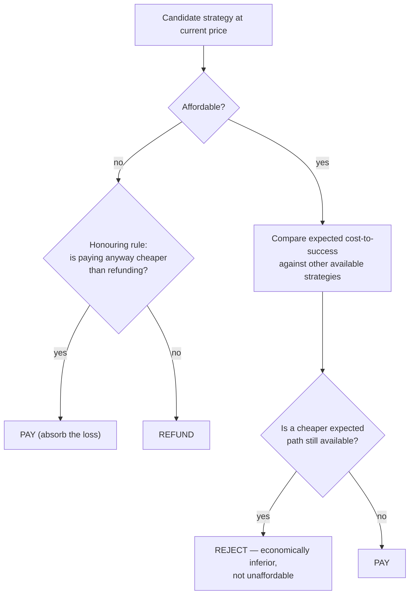
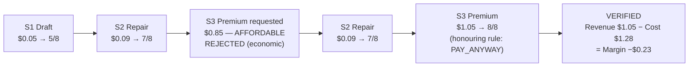

# Margin402 — Diagrams

Five diagrams a judge needs to understand the product. Each one matches the actual
implementation, referenced by file where relevant.

## 1. System Architecture

## 2. x402 Payment Flow

## 3. Outcome Underwriting Loop

## 4. Economic Decision

*Affordable ≠ economically optimal — this is the distinction the $0.85 rejection in the
canonical demo exists to make visible.*

## 5. Canonical Demo Timeline

